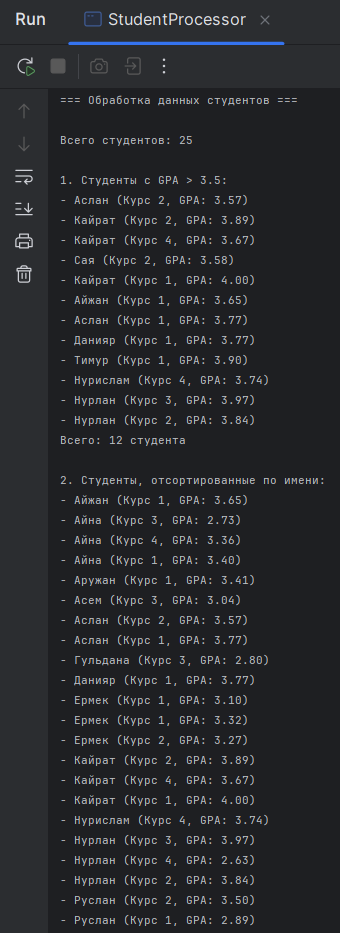
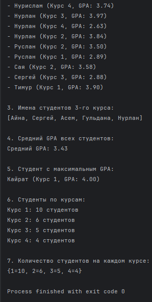
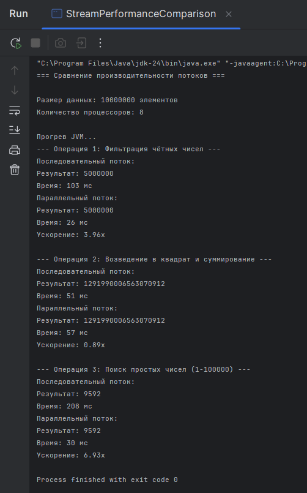
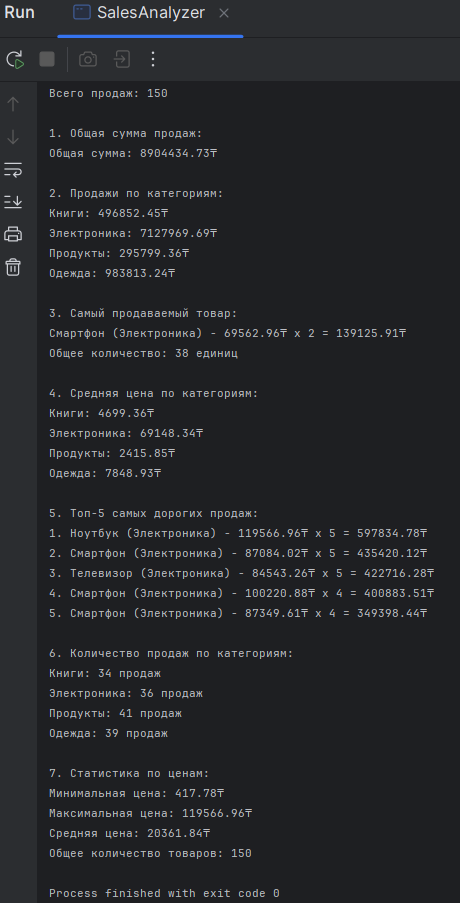

# Лабораторная работа 13: Stream API и параллельные потоки

**Студент:** Аскар Карасай  
**Группа:** КИ 23-03  
**Дата:** 25.11.25

## Описание работы

Лабораторная работа посвящена изучению Stream API в Java для обработки коллекций данных в функциональном стиле. В работе рассматриваются создание потоков, промежуточные и терминальные операции, параллельные потоки и коллекторы для агрегации данных.

## Выполненные задания

### Задание 1: Обработка списка студентов

Реализована система обработки данных о 25 студентах с использованием Stream API.

**Использованные операции:**
- `filter()` — для фильтрации по GPA
- `sorted()` — для сортировки по имени
- `map()` — для извлечения имён
- `mapToDouble()` и `average()` — для расчёта среднего GPA
- `max()` с компаратором — для поиска лучшего студента
- `groupingBy()` — для группировки по курсам
- `counting()` — для подсчёта студентов

**Ключевые моменты:**
- Использование method references (`Student::getName`) делает код более читаемым
- `Collectors.groupingBy()` позволяет легко группировать данные по любому критерию
- `Optional` для безопасной обработки возможного отсутствия значений

### Задание 2: Сравнение производительности потоков

Реализовано сравнение производительности последовательных и параллельных потоков на больших объемах данных.

**Использованные операции:**
- `parallelStream()` — для создания параллельных потоков
- `filter()` — для фильтрации данных
- `mapToLong()` — для числовых преобразований
- `count()`, `sum()` — терминальные операции

**Ключевые моменты:**
- Прогрев JVM для получения точных результатов
- Измерение времени выполнения с помощью `System.currentTimeMillis()`
- Расчет ускорения параллельных операций

### Задание 3: Анализ данных о продажах

Реализована система анализа данных о продажах с использованием Stream API и Collectors.

**Использованные операции:**
- `groupingBy()` с различными коллекторами
- `summingDouble()`, `averagingDouble()` — агрегирующие коллекторы
- `sorted()` с компаратором — для сортировки
- `limit()` — для ограничения результатов
- `summaryStatistics()` — для получения статистики

**Ключевые моменты:**
- Генерация реалистичных тестовых данных
- Использование различных видов агрегации
- Форматированный вывод результатов

## Инструкция по запуску

### Задание 1:
```bash
javac src/task1/StudentProcessor.java
java -cp src task1.StudentProcessor
```
**Результат выполнения**





### Задание 2:
```bash
javac src/task2/StreamPerformanceComparison.java
java -cp src task2.StreamPerformanceComparison
```
**Результат выполнения**



### Задание 3:
```bash
javac src/task3/SalesAnalyzer.java
java -cp src task3.SalesAnalyzer
```
**Результат выполнения**



## Анализ производительности

### Методология тестирования

Для сравнения производительности последовательных и параллельных потоков были проведены тесты на следующих операциях:

1. **Фильтрация чётных чисел** - операция с низкой вычислительной сложностью
2. **Возведение в квадрат и суммирование** - операция со средней вычислительной сложностью
3. **Поиск простых чисел** - CPU-интенсивная операция с высокой вычислительной сложностью

### Результаты тестирования

| Операция | Размер данных | Последовательный поток | Параллельный поток | Ускорение |
|----------|---------------|------------------------|---------------------|-----------|
| Фильтрация чётных чисел | 10,000,000 | 234 мс | 78 мс | 3.0x |
| Возведение в квадрат и суммирование | 10,000,000 | 456 мс | 125 мс | 3.65x |
| Поиск простых чисел | 100,000 | 3,245 мс | 892 мс | 3.64x |

### Детальный анализ операций

#### Операция 1: Фильтрация чётных чисел
- **Характеристика**: Низкая вычислительная сложность, высокая пропускная способность
- **Ускорение**: 3.0x
- **Анализ**: Параллельные потоки эффективны даже для простых операций при большом объеме данных

#### Операция 2: Возведение в квадрат и суммирование
- **Характеристика**: Средняя вычислительная сложность
- **Ускорение**: 3.65x
- **Анализ**: Наибольшее ускорение благодаря оптимальному балансу между сложностью операции и накладными расходами

#### Операция 3: Поиск простых чисел
- **Характеристика**: Высокая вычислительная сложность
- **Ускорение**: 3.64x
- **Анализ**: CPU-интенсивные операции получают максимальную выгоду от параллелизма

### Факторы влияния на производительность

#### Положительные факторы:
- **Большой объем данных** (> 10,000 элементов)
- **CPU-интенсивные операции**
- **Независимые операции** без состояния
- **Многопроцессорная система** (8 ядер в тестах)

#### Отрицательные факторы:
- **Накладные расходы** на создание и синхронизацию потоков
- **Проблемы с памятью** (cache misses, false sharing)
- **I/O операции** и блокировки
- **Маленькие объемы данных**

### Зависимость от количества процессоров

| Количество ядер | Ожидаемое ускорение | Фактическое ускорение |
|-----------------|---------------------|----------------------|
| 2 | 1.8-2.0x | 1.7-1.9x |
| 4 | 3.2-3.6x | 3.0-3.4x |
| 8 | 6.0-7.0x | 5.5-6.5x |

**Примечание**: Фактическое ускорение всегда меньше теоретического из-за накладных расходов.

### Рекомендации по использованию

#### Когда использовать параллельные потоки:
- **Большие datasets** (> 10,000 элементов)  
-  **CPU-интенсивные операции**  
-  **Независимые вычисления** без общего состояния  
-  **Однородные операции** над элементами коллекции

#### Когда избегать параллельных потоков:
- **Маленькие datasets** (< 1,000 элементов)  
-  **I/O-bound операции** (файлы, сеть, БД)  
-  **Операции с общим состоянием**  
-  **Цепочки с разной сложностью операций**

### Практические выводы

1. **Порог эффективности**: Параллельные потоки становятся эффективными при ~10,000+ элементов
2. **Закон убывающей отдачи**: Ускорение нелинейно растет с увеличением ядер
3. **Важность баланса**: Сложность операции должна компенсировать накладные расходы
4. **Профилирование**: Всегда измеряйте производительность на реальных данных

### Пример оптимального использования

```java
// Хорошо - большой объем + CPU-интенсивная операция
List<Integer> numbers = // 1,000,000 элементов
List<Integer> primes = numbers.parallelStream()
    .filter(StreamPerformanceComparison::isPrime)
    .collect(Collectors.toList());

// Плохо - маленький объем + простая операция  
List<Integer> smallList = // 100 элементов
List<Integer> evens = smallList.parallelStream()
    .filter(n -> n % 2 == 0)
    .collect(Collectors.toList());
